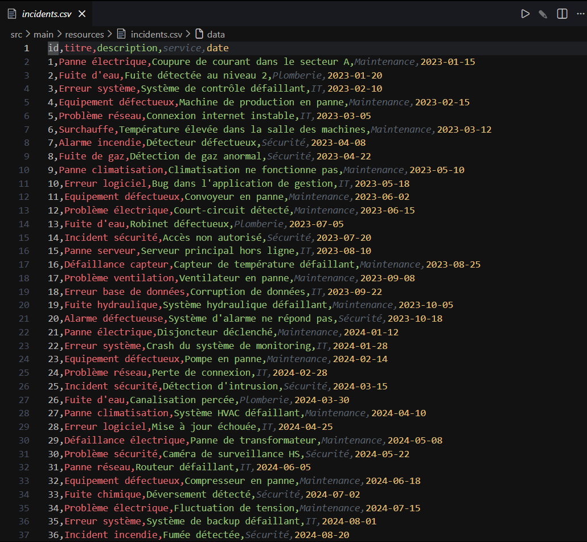
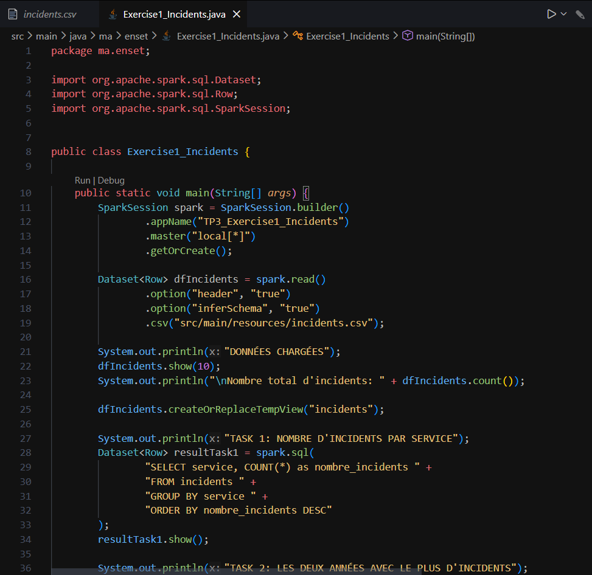
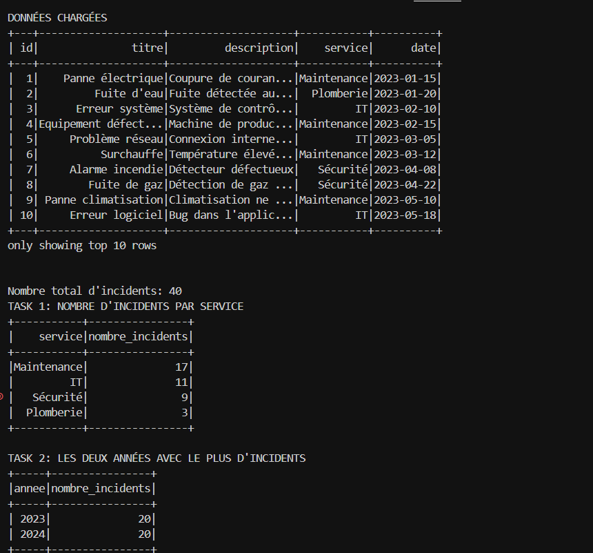
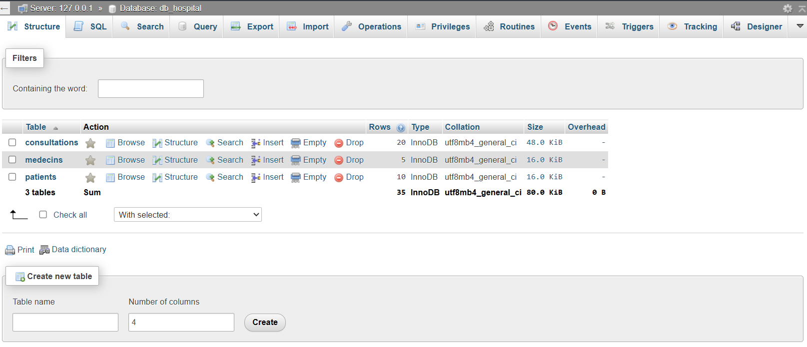
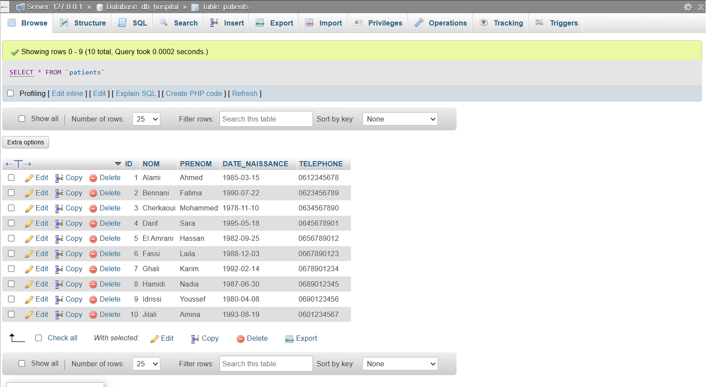
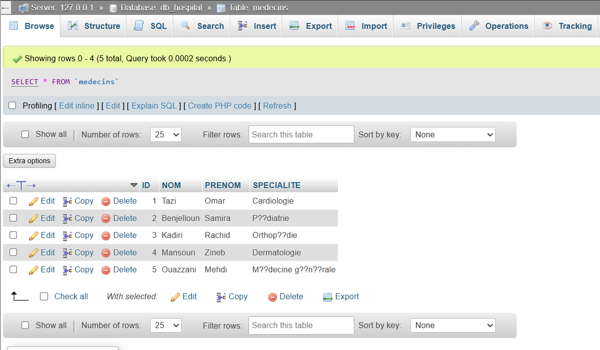
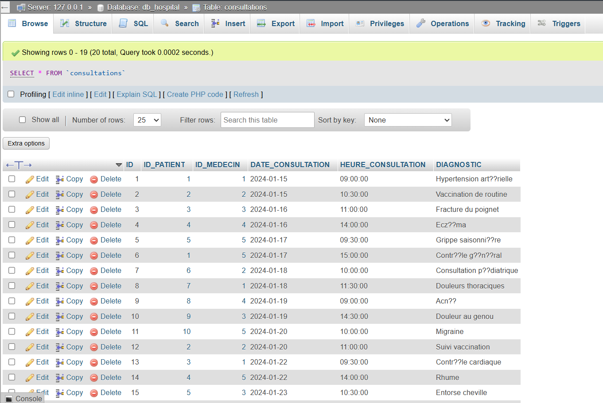
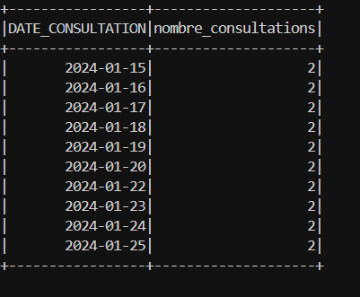
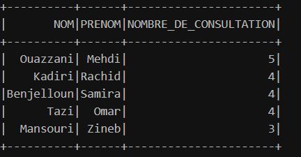
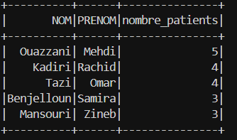

# TP 3: Spark SQL - Rapport

**Étudiant:** [Votre Nom]  
**Date:** 6 Décembre 2025

---

## Structure du Projet

Ce projet Maven utilise **Spark SQL**.

**Dépendances principales:**
- Apache Spark 3.5.0 (spark-sql, spark-core)
- MySQL Connector Java 8.0.33
- Java 8

---

## Exercice 1: Traitement des Incidents par Service

### Description
Application Spark SQL qui traite les incidents d'une entreprise industrielle. Les données sont stockées dans un fichier CSV avec le format: `id, titre, description, service, date`.

### Fichiers
- `src/main/resources/incidents.csv` - Données des incidents (40 incidents)
- `src/main/java/ma/enset/Exercise1_Incidents.java` - Code Spark SQL

### Exécution

```bash
mvn clean compile
mvn exec:java -Dexec.mainClass="ma.enset.Exercise1_Incidents"
```

### Résultats

#### 📸 **Fichier CSV incidents.csv**

*Fichier source contenant les 40 incidents avec colonnes: id, date, service, description*

---

#### Task 1: Nombre d'incidents par service

**Requête SQL:**
```sql
SELECT service, COUNT(*) as nombre_incidents
FROM incidents
GROUP BY service
ORDER BY nombre_incidents DESC
```

#### 📸 **Code Exercise1_Incidents.java**

*Implémentation Spark SQL avec chargement CSV et requêtes d'agrégation*

**Analyse:**
- Service avec le plus d'incidents: **Maintenance (17 incidents)**
- Service avec le moins d'incidents: **Plomberie (3 incidents)**
- Distribution: Maintenance (17), IT (11), Sécurité (9), Plomberie (3)
- Le service Maintenance représente 42.5% de tous les incidents

---

#### Task 2: Les deux années avec le plus d'incidents

**Requête SQL:**
```sql
SELECT YEAR(date) as annee, COUNT(*) as nombre_incidents
FROM incidents
GROUP BY YEAR(date)
ORDER BY nombre_incidents DESC
LIMIT 2
```

#### 📸 **Résultats d'exécution Exercise 1**

*Sortie complète montrant: données chargées (10 premières lignes), Task 1 (incidents par service), Task 2 (incidents par année)*

**Analyse:**
- Année avec le plus d'incidents: **2023 et 2024 (égalité à 20 incidents chacune)**
- Distribution équilibrée: 50% en 2023, 50% en 2024
- Stabilité du nombre d'incidents sur les deux années

---

## Exercice 2: Système de Gestion Hospitalière

### Description
Application Spark SQL qui traite les données d'un hôpital à partir d'une base MySQL. La base `DB_HOSPITAL` contient trois tables: PATIENTS, MEDECINS, et CONSULTATIONS.

### Prérequis
1. Installer MySQL
2. Exécuter le script SQL: `src/main/resources/setup_database.sql`

```bash
mysql -u root -p < src/main/resources/setup_database.sql
```

### Fichiers
- `src/main/resources/setup_database.sql` - Script de création de la base
- `src/main/java/ma/enset/Exercise2_Hospital.java` - Code Spark SQL

### Configuration MySQL

**⚠️ Important:** Modifiez le mot de passe MySQL dans `Exercise2_Hospital.java`:
```java
properties.setProperty("password", "votre_mot_de_passe");
```

### Exécution

```bash
mvn exec:java -Dexec.mainClass="ma.enset.Exercise2_Hospital"
```

### Résultats

#### 📸 **Structure de la base de données**

*Base DB_HOSPITAL avec 3 tables: PATIENTS (10 lignes), MEDECINS (5 lignes), CONSULTATIONS (20 lignes)*

---

#### 📸 **Table PATIENTS**

*10 patients avec informations: ID, NOM, PRENOM, DATE_NAISSANCE, TELEPHONE*

---

#### 📸 **Table MEDECINS**

*5 médecins avec spécialités: Cardiologie, Pédiatrie, Orthopédie, Dermatologie, Médecine générale*

---

#### 📸 **Table CONSULTATIONS**

*20 consultations avec détails: ID, ID_PATIENT, ID_MEDECIN, DATE_CONSULTATION, HEURE_CONSULTATION, DIAGNOSTIC*

---

#### Task 1: Nombre de consultations par jour

**Requête SQL:**
```sql
SELECT DATE_CONSULTATION, COUNT(*) as nombre_consultations
FROM consultations
GROUP BY DATE_CONSULTATION
ORDER BY DATE_CONSULTATION
```

#### 📸 **Résultat Task 1**

*Nombre de consultations par jour*

**Analyse:**
- Distribution uniforme: **2 consultations par jour** pour tous les jours
- Période couverte: 10 jours (du 15 au 25 janvier 2024)
- Total: 20 consultations réparties de manière équilibrée
- Charge de travail constante sans pics d'activité

---

#### Task 2: Nombre de consultations par médecin

**Requête SQL:**
```sql
SELECT m.NOM, m.PRENOM, COUNT(*) as NOMBRE_DE_CONSULTATION
FROM consultations c
JOIN medecins m ON c.ID_MEDECIN = m.ID
GROUP BY m.NOM, m.PRENOM
ORDER BY NOMBRE_DE_CONSULTATION DESC
```

#### 📸 **Résultat Task 2**

*Nombre de consultations par médecin (NOM | PRENOM | NOMBRE_DE_CONSULTATION)*

**Analyse:**
- Médecin avec le plus de consultations: **Dr. Ouazzani Mehdi (5 consultations)** - Médecine générale
- Suivi par: Dr. Kadiri (4), Dr. Benjelloun (4), Dr. Tazi (4) - tous avec 4 consultations
- Médecin avec le moins: **Dr. Mansouri Zineb (3 consultations)** - Dermatologie
- Charge relativement équilibrée entre les médecins (3-5 consultations)

---

#### Task 3: Nombre de patients assistés par médecin

**Requête SQL:**
```sql
SELECT m.NOM, m.PRENOM, COUNT(DISTINCT c.ID_PATIENT) as nombre_patients
FROM consultations c
JOIN medecins m ON c.ID_MEDECIN = m.ID
GROUP BY m.NOM, m.PRENOM
ORDER BY nombre_patients DESC
```

#### 📸 **Résultat Task 3**

*Nombre de patients distincts assistés par médecin*

**Analyse:**
- Médecin ayant assisté le plus de patients différents: **Dr. Ouazzani Mehdi (5 patients)** - Médecine générale
- Dr. Kadiri et Dr. Tazi: 4 patients chacun
- Dr. Benjelloun et Dr. Mansouri: 3 patients chacun
- **Observation importante:** Dr. Ouazzani a 5 consultations pour 5 patients différents (aucun patient récurrent), tandis que Dr. Benjelloun a 4 consultations mais seulement 3 patients distincts (1 patient a consulté 2 fois)
- La médecine générale (Dr. Ouazzani) traite naturellement plus de patients variés

---

## Conclusion

Ce TP a permis de:
1. ✅ Utiliser **Spark SQL** pour analyser des données CSV
2. ✅ Connecter Spark à une base de données MySQL via JDBC
3. ✅ Effectuer des requêtes SQL complexes avec agrégations et jointures
4. ✅ Traiter des données de manière distribuée et parallèle

**Note:** Ce projet utilise **Spark SQL** et **DataFrames**, pas les RDDs (Resilient Distributed Datasets), car Spark SQL offre:
- API de plus haut niveau
- Optimisations automatiques (Catalyst optimizer)
- Meilleure performance
- Syntaxe SQL familière

---

## Commandes Utiles

### Compilation
```bash
mvn clean compile
```

### Exécuter Exercise 1
```bash
mvn exec:java -Dexec.mainClass="ma.enset.Exercise1_Incidents"
```

### Exécuter Exercise 2
```bash
mvn exec:java -Dexec.mainClass="ma.enset.Exercise2_Hospital"
```

### Package (créer un JAR)
```bash
mvn clean package
```
